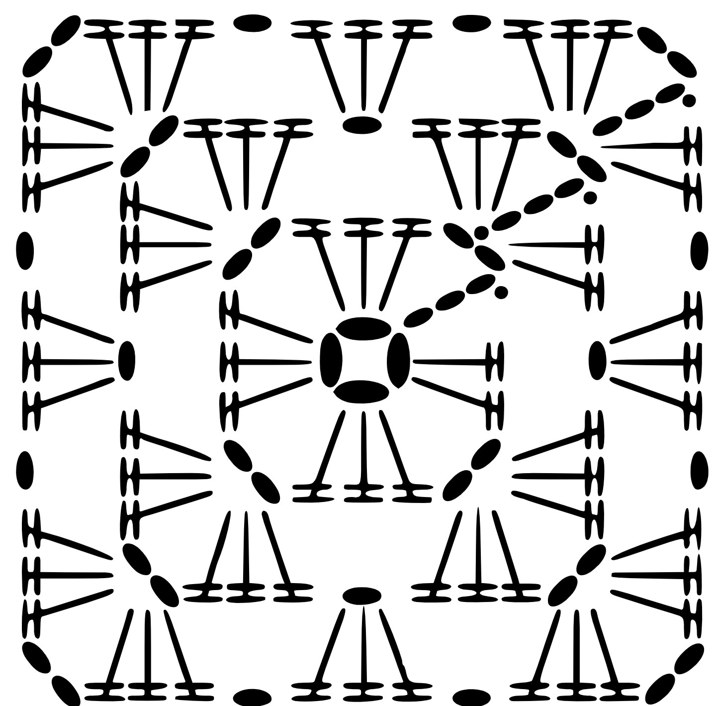
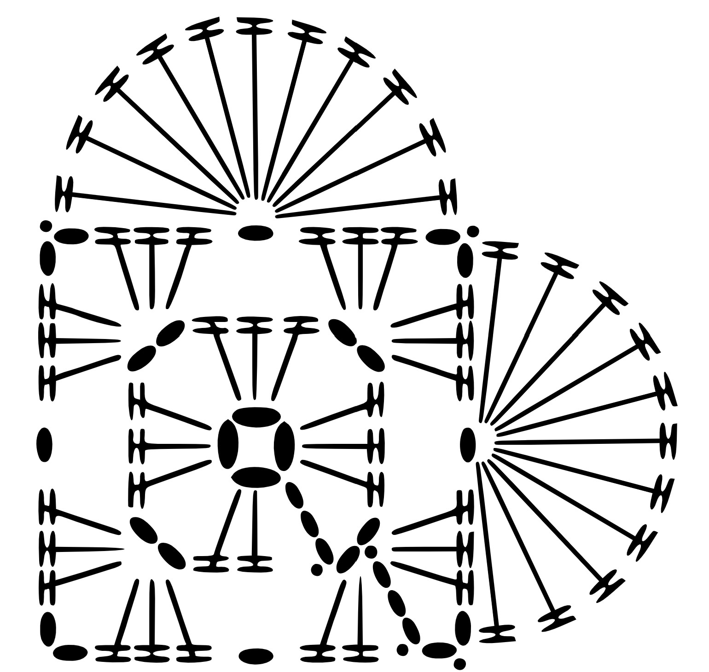

# Patterns

    <a href="../diagram-patterns/diagram-granny-square/index.html">
        Granny Square
        

            

            
        

    </a>

    <a href="../diagram-patterns/diagram-heart-pattern/index.html">
        Heart Pattern
        

            

            
        

    </a>

