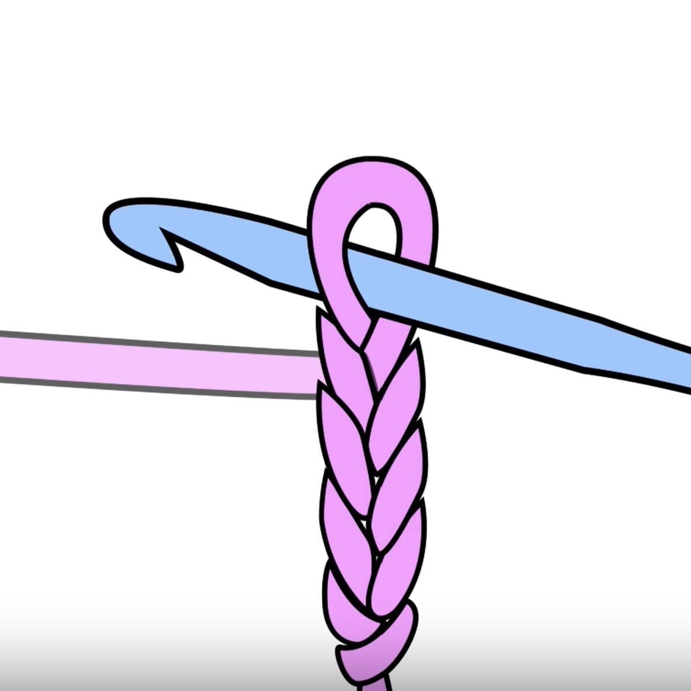
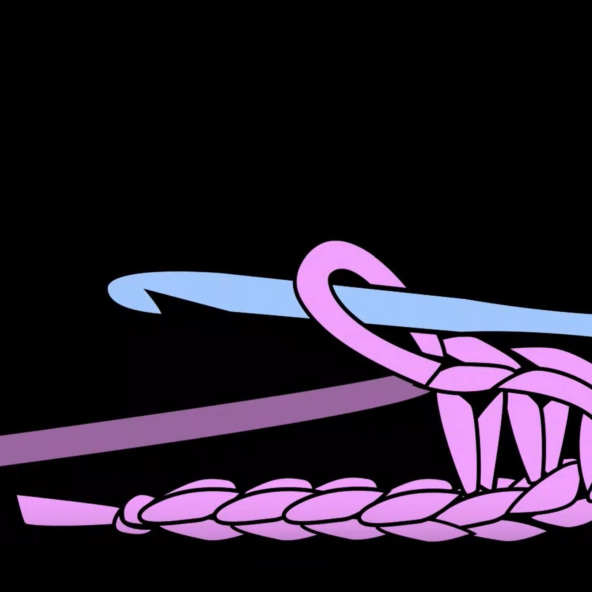
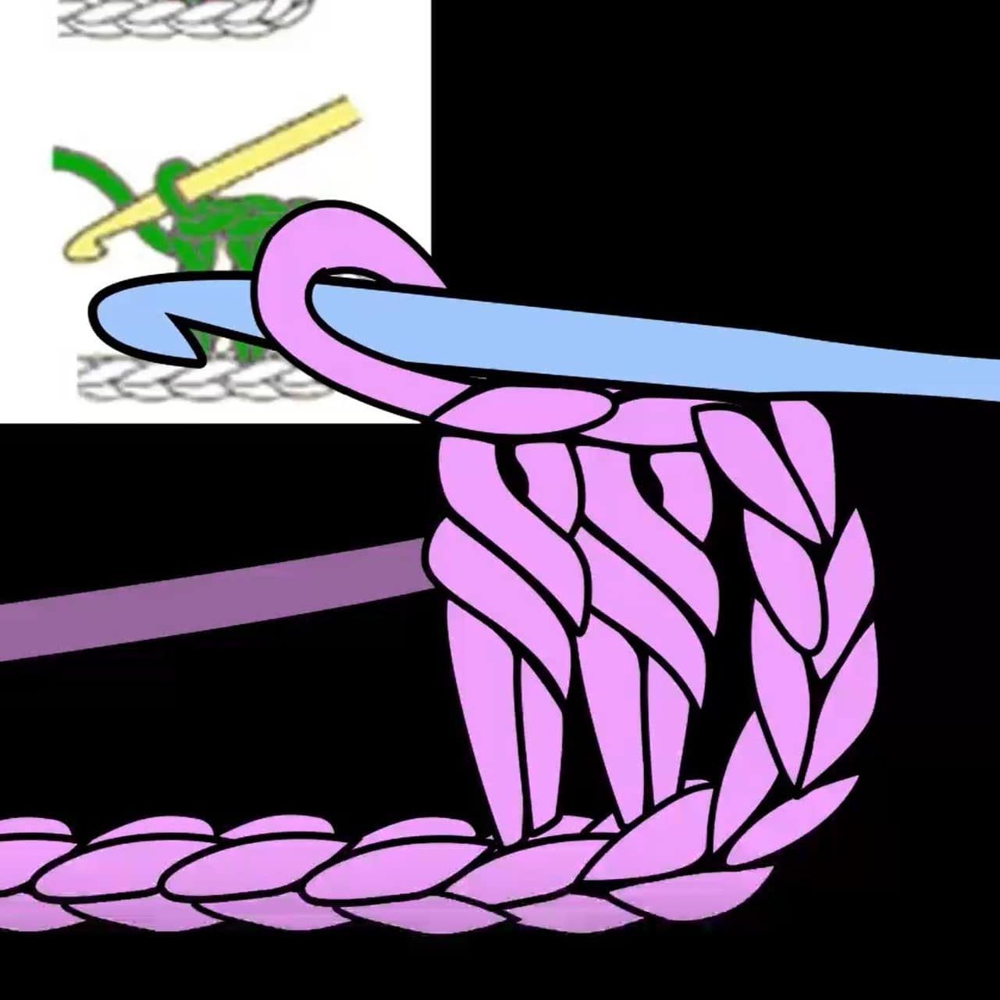

# Stitches

    <a href="../stitches/chain/index.html">
        Chain
        

            

            

        

    </a>

    <a href="../stitches/single-crochet/index.html">
        Single Crochet
        

            

            

        

    </a>

    <a href="../stitches/double-stitch/index.html">
        Double Crochet
        

            

            

        

    </a>

[//]: # (
)

[//]: # (    <a href="../stitches/slip-stitch/index.html">)

[//]: # (        Slip Stitch)

[//]: # (        
)

[//]: # (            

)

[//]: # (            

)

[//]: # (        
)

[//]: # (    </a>)

[//]: # (
)

